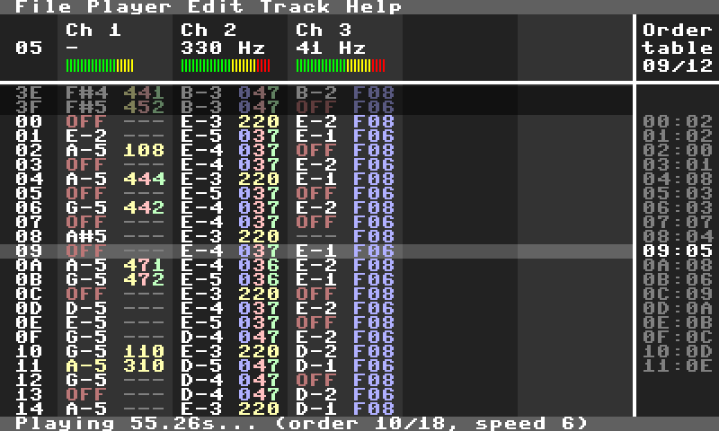

# Polytone
A modern re-implementation of the MONOTONE tracker with many enhancements.



Thanks to SDL2, it runs on all major platforms (Linux, macOS and Windows).
It uses its own file format (.POL) for expanded effect values & pattern packing,
but it still has the ability to import your old Monotone files.

New features include:
- Full-range effects (8-bit values instead of only 6-bit)!
- Pattern packing (so the file sizes are _usually_ smaller)
- Mouse support for navigating menus
- Cut/Copy/Paste (works system-wide, so you can easily copy parts of one song to another)
- Built-in fully documented effects reference (todo: a full manual)
- Colorful tracker window
- etc.

Please visit the [PTPlayer repo](https://github.com/prochazkaml/PTPlayer) for more information about MONOTONE and the Polytone file format.

## Basic controls

Keep in mind that Polytone uses raw scancodes for each key, so it doesn't matter which keyboard layout you have.

Moving the cursor:

```
↑/↓/←/→ = Move the cursor by 1 row/column
Ctrl+↑/↓ = Move the cursor by 16 rows
PgUp/PgDn = Move the cursor by 64 rows
Home/End = Go to the start/end of the pattern
```

Entering notes for the lower octave:

```
 A S   F G H   →    C#3 D#3     F#3 G#3 A#3
Z X C V B N M  →  C3  D3  E3  F3  G3  A3  B3
```

Entering notes for the higher octave(s):

```
 2 3   5 6 7   9 0   =   →    C#4 D#4     F#4 G#4 A#4     C#5 D#5     F#5
Q W E R T Y U I O P [ ]  →  C4  D4  E4  F4  G4  A4  B4  C5  D5  E5  F5  G5
```

The current octave can be changed by `F9` & `F10`.

Other data manipulation:
```
Space = Enter "OFF" note (stops the playback of the current note)
Backspace = Delete the currently selected note/effect and move the cursor 1 row down
Delete = Delete the currently selected note/effect and move the rest of the data till the end of the pattern up
Insert or Ctrl+Space = Insert a black space and move the rest of the data till the end of the pattern down
```

Order table manipulation:

```
Ctrl+←/→ = Change the pattern for the current order entry
F11 = Remove the current order entry
F12 = Add a new order entry
```

Selection/Clipboard:

```
Shift+(one of the movement keys) = Start a selection
Ctrl+A = Select the entire pattern
(when selected) Backspace = Clear the data in the current selection
(when selected) Delete = Delete the data in the current selection and move the rest of the data till the end of the pattern up
Ctrl+X = Cut the current selection
Ctrl+C = Copy the current selection
Ctrl+V = Paste the current selection
```

Playback:

```
F4 = Preview the current line
F5 = Play from the current position
F6 = Play from the start of the song
F7 = Play from the start of the current pattern
F8 = Stop
```

During playback, you may also press the `1-0, -, =` keys to mute certain channels.

Effects (hexadecimal values: 0-9, A-F) are typed as they normally would be on a US keyboard.

## Building for Linux/macOS

``` bash
# For Debian/Ubuntu:
sudo apt-get install build-essential git zenity libsdl2-dev

# For macOS:
brew install sdl2

git clone --recurse-submodules https://github.com/prochazkaml/Polytone
cd Polytone
make
./build/polytone
```

It's as simple as that. On macOS, make sure to install [Homebrew](https://brew.sh/) first.

## Cross-building for Windows (from Linux)

``` bash
sudo apt-get install build-essential git gcc-mingw-w64-x86-64 # For Debian/Ubuntu
git clone --recurse-submodules https://github.com/prochazkaml/Polytone
cd Polytone

# One-time setup
wget https://www.libsdl.org/release/SDL2-devel-2.0.16-mingw.tar.gz -O SDL.tar.gz
tar -xf SDL.tar.gz
sudo rsync -a SDL2-2.0.16/x86_64-w64-mingw32/ /usr/x86_64-w64-mingw32
cp SDL2-2.0.16/x86_64-w64-mingw32/bin/SDL2.dll .
rm -rf SDL*

# Start the build
make build/polytone.exe

# To generate a GitHub release, run:
make pkg_windows
```

## To-do list

- Add undo/redo
- Write the manual
- bugfix: If there are diacritics in the path (on Windows), then the program won't load from cmdline
- Adjustable window size
- Stereo audio output?
- Instrument support
- Implement exporting to MIDI (with functioning effects!)
